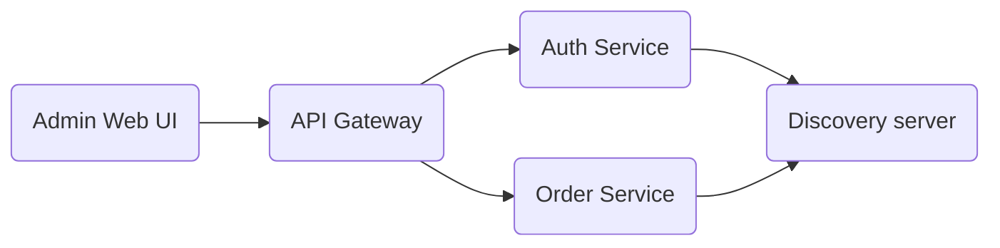

# Onyx API Gateway
Onyx is a web-based system for optimizing business processes. Onyx is secure and very performant management tool for small and mid-sized service companies.

## Overview
The system makes use of a microservice-oriented architecture.

Here is a brief architecture diagram to visualize the flow of work of the system

### Explaination:
Each request, coming from the Web UI, is forwared to the API Gateway which protects the system. Each request should contain a valid JWT token to perform the respective operation. In case of invalid token or empty token, the system returns **401 (Unauthorized)**. 
- **Auth Service** repository link - is responsible for generating, revoking and refreshing tokens as well as for creating and modifying users.
- **Order Service** repository link - is the core of the system and it is responsible for the core business logic (BL). Order management, LimpoUnits (Utilities) Management and also Client management **REST API**  

## Technical stack
All the backend services are written in **Java** (Spring boot) and compiled with Java 17 LTS and **React JS** for the Admin Web UI
